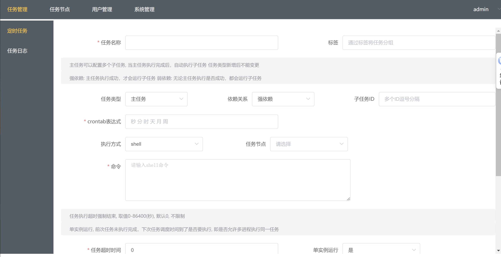
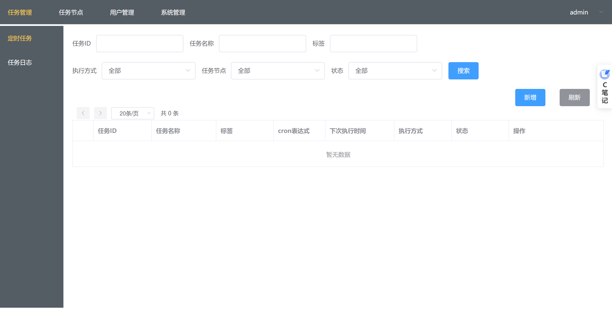
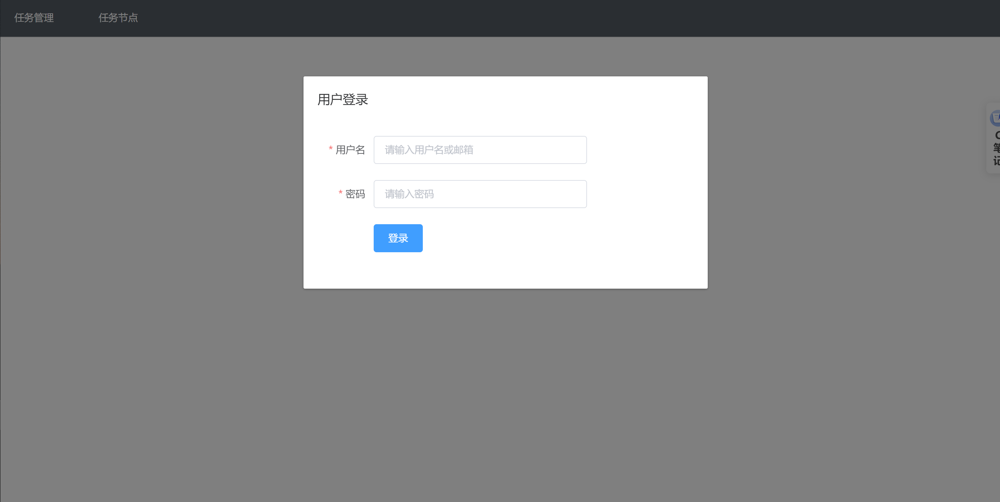

# gocron - 定时任务管理系统
# 项目简介
使用Go语言开发的轻量级定时任务集中调度和管理系统, 用于替代Linux-crontab [查看文档](https://github.com/ouqiang/gocron/wiki)

原有的延时任务拆分为独立项目[延迟队列](https://github.com/ouqiang/delay-queue)  

## 功能特性
* Web界面管理定时任务

* crontab时间表达式, 精确到秒

* 任务执行失败可重试

* 任务执行超时, 强制结束

* 任务依赖配置, A任务完成后再执行B任务

* 账户权限控制

* 任务类型
    * shell任务
    > 在任务节点上执行shell命令, 支持任务同时在多个节点上运行
    * HTTP任务
    > 访问指定的URL地址, 由调度器直接执行, 不依赖任务节点
    
* 查看任务执行结果日志

* 任务执行结果通知, 支持邮件、Slack、Webhook

## 安装

###  二进制安装

1. 下载https://github.com/ouqiang/gocron/releases解压压缩包   
2. `cd 解压目录`   
3. 启动        

* 调度器启动        
  * Windows: `gocron.exe web`   
  * Linux、Mac OS:  `./gocron web`
* 任务节点启动, 默认监听0.0.0.0:5921
  * Windows:  `gocron-node.exe`
  * Linux、Mac OS:  `./gocron-node`

4. 浏览器访问 http://localhost:5920

### 截图

### 

用户名：admin 密码：admin1234
