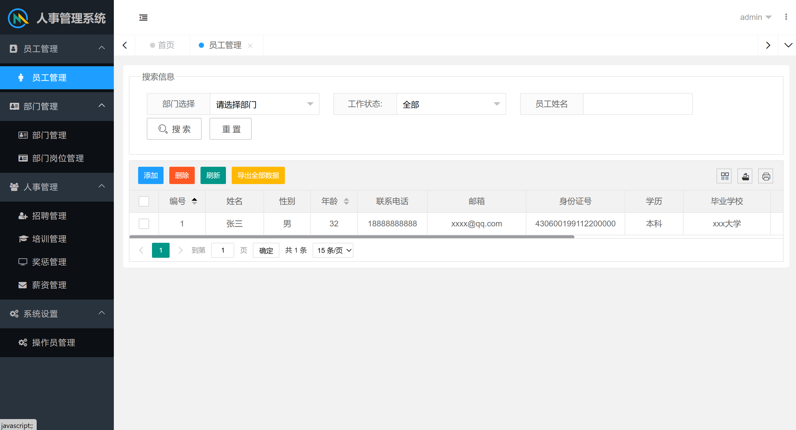

# 人事管理系统

#### 系统介绍
本系统为职工人事管理系统毕业设计作品，系统分为七大模块：职工管理，部门管理，岗位管理，招聘管理，奖惩管理，薪资管理，培训管理

系统默认有两个个角色：管理员，普通用户

- 管理员（admin/admin123）：可以操作所有功能、增加用户
- 普通用户（test/test）：只可查看记录、无法修改

#### 主要技术
Springboot+MyBatis+MySQL+Layui-mini后台框架
使用Shiro进行基于角色权限控制，使用又拍云OSS存储图片

#### 系统版本
MySQL 5.7

#### 安装部署

1. 导入项目的sql文件`src/main/resources/sql/ehr.sql`

2. 将项目中`resources/application-dev.yml`配置文件中的数据库地址

3. 部署前端项目（ehr-admin目录）配置nginx部署:

   ```shell
   user www-data;
   worker_processes auto;
   pid /run/nginx.pid;
   include /etc/nginx/modules-enabled/*.conf;
   
   events {
   	worker_connections 768;
   	# multi_accept on;
   }
   
   http {
   
   	sendfile on;
   	tcp_nopush on;
   	types_hash_max_size 2048;
   
   server {
           listen        80;
           server_name  localhost;
           
           location / {
           # 前端项目位置
   	    root   /var/www/html/ehr-admin;
            
           }
   }
   	include /etc/nginx/mime.types;
   	default_type application/octet-stream;
   	access_log /var/log/nginx/access.log;
   	error_log /var/log/nginx/error.log;
   }
   
   
   ```

   修改 `ehr-admin/layuimini/js/lay-module/common/common.js `文件的localhost为服务器IP：

   ```shell
   layui.define(['layer', 'jquery'], function (exports) {
     var $ = layui.jquery
   
     var common = {
       //接口地址
       api: 'http://localhost:8080',
   
   ```

   

4. 运行成功后，在浏览器中输入地址进行访问：http://ip/

   管理员账号: admin 密码: admin123  
   普通用户：test 密码：test  

#### 系统截图





